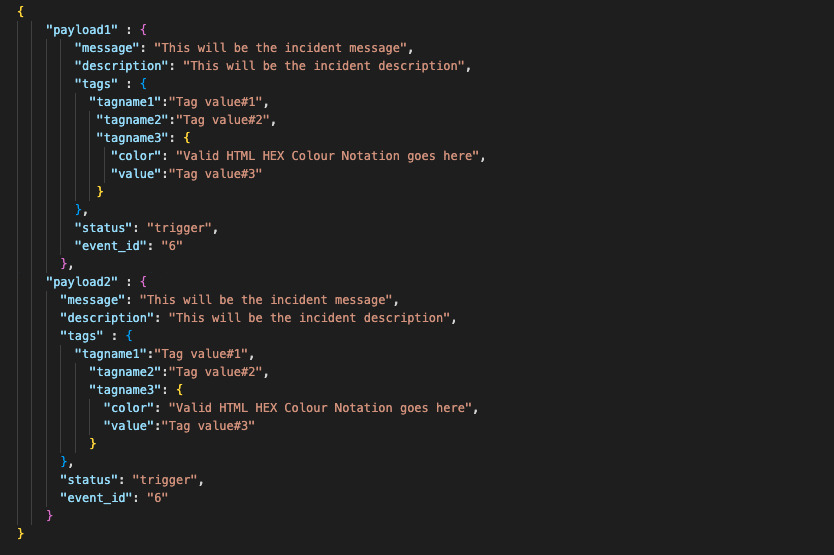

# Squadcast Webhook Connectors

This repository contains the code for the Squadcast Heartbeat Monitor
The repository supports : 
* GET & POST HTTP Requests ( Default : GET )
* Multiple URL
* User definable Ping intervals
* User definable custom Request Payloads
* Supports Squadcast's Incident Webhook for notifying when URLs are down


## Prerequisites
- git
- NodeJs | npm
- nodemon
### Tip : For Linux Users, just execute the command below to install all the NodeJS prerequisites
```
bash dependencies.sh
```

## Setting Up

Set Ping Interval `Required` :- 
* Ping interval for set inside .env file. Users can set Ping interval value & Time-Unit just like shown below. Eg. :


    Note : We recommend to not set the interval below 30 Seconds

Set Squadcast's Incident Webhook `Required` :- 
Squadcast's Heartbeat Monitor supports Incident webhook to notify whenever a URL goes down.
* Incident Webhook can be set inside .env file. Users can define the Incident Webhook just like shown below. Eg. :


* Tip : To get you own Squadcast's Incident Webhook, follow this documentation : https://support.squadcast.com/integrations/incident-webhook-incident-webhook-api

Define URLs `Required` :- 
Squadcast's Heartbeat Monitor supports Multiple URLs that you can monitor and can get notfied whenever they go down.
* To set the URLs, navigate to `URL.json` and define the URLs just like shown below. Eg. :


Change HTTP Rquest Method :- 
* To change the HTTP request method, navigate to .env file and set the method under the variable `DEFAULT_HTTP_METHOD`.


Add POST Request Payloads :- 
* To add the HTTP POST request payloads, navigate to `DATA.json` and define the payloads just like shown below. Eg. :


* If you wish to send different payloads for different URLs. Then set the `USE_CUSTOM_PAYLOAD_VARIABLES` variable to `yes`. Eg. :


## Getting Started
 - Clone this repo
```sh
git clone https://github.com/SquadcastHub/Squadcast-Heartbeat-Monitor.git
```
- Install dependencies
```sh
npm install
```
- Run
```sh
npm start
```
----
----
----
